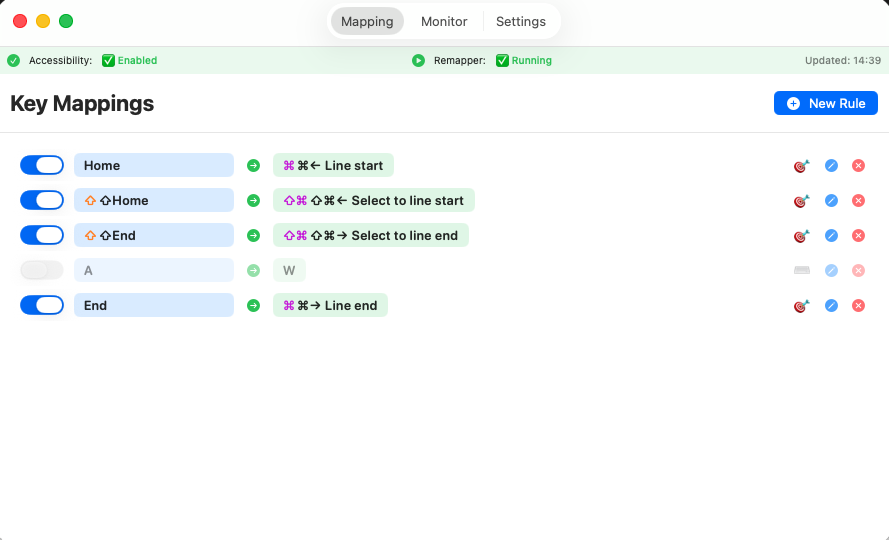
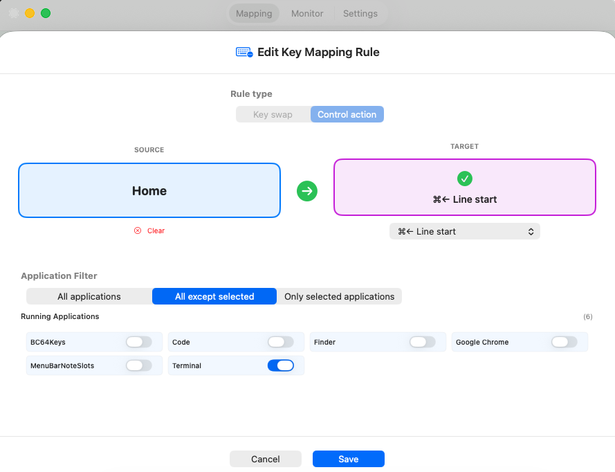

# BC64Keys 🎹

**A simple, secure keyboard remapper for macOS** — the straightforward alternative to Karabiner Elements.

**NEW in v1.6.0:** 🌍 Full multi-language support for all 28 navigation actions in 14 languages!

[](https://github.com/badcode64/BC64Keys/releases/latest)
[](LICENSE)
[]()
[]()
[]()

---

## Why BC64Keys?

**Frustrated with Karabiner's complexity?** You're not alone.

I created BC64Keys because I just wanted to **remap a few keys** — not learn a new configuration language, edit JSON/XML files, or navigate through hundreds of options.

### BC64Keys vs Karabiner Elements

| Feature | BC64Keys | Karabiner Elements |
|---------|----------|-------------------|
| Configuration | Visual GUI, click & press | JSON config files |
| Learning curve | ⚡ Minutes | 📚 Hours/Days |
| Codebase size | ~2,100 lines | ~100,000+ lines |
| Code auditability | ✅ Easy to review | ❌ Very complex |
| Setup time | 30 seconds | 10-30 minutes |
| Universal Binary | ✅ Apple Silicon + Intel | ✅ Yes |
| Code Signing | ✅ Developer ID | ✅ Yes |
| Notarized | ✅ Apple Notarized | ✅ Yes |

### 🔒 Security First

**This app has access to your keystrokes** — that's how keyboard remapping works. 

This is why BC64Keys is:
- **100% Open Source** (GPL-3.0)
- **Single file design** (~2,100 lines) — anyone can audit it in minutes
- **No network access** — works completely offline
- **No data collection** — your keystrokes stay on your Mac
- **No external dependencies** — pure Swift/SwiftUI
- **Apple Notarized** — verified and signed by Apple's security team

> Unlike massive, complex tools where security vulnerabilities can hide in thousands of files, BC64Keys is simple enough that **you can read and verify the entire codebase yourself in under an hour**.

---

## Features ✨

- **🖱️ Visual Key Capture** — Just click and press the key you want to remap
- **🔄 Simple Key Swaps** — Remap any key to any other key
- **🎯 Navigation Actions** — Map keys to macOS shortcuts (Home → Cmd+←, etc.)
- **� Per-App Filtering** — Apply mappings globally, or only in specific apps
- **🚫 Key Blocking** — Disable annoying keys completely
- **🔍 Real-time Monitor** — See exactly what keys are being pressed
- **🚀 Launch at Login** — Optional auto-start when you log in (toggle in Settings)
- **🌍 Multi-language** — 14 languages: English, Hungarian, German, French, Spanish, Italian, Japanese, Chinese, Dutch, Portuguese, Swedish, Polish, Korean, Turkish
- **⚡ Instant Apply** — Changes take effect immediately, no restart needed
- **💾 Auto-save** — Your mappings persist between app restarts
- **🎨 Native UI** — Clean SwiftUI interface that feels like macOS
- **🔐 Secure** — Signed with Developer ID and notarized by Apple

### Perfect for Windows Switchers 🪟→🍎

Coming from Windows? BC64Keys includes pre-configured actions for:
- Home/End → Line start/end (⌘←/⌘→)
- Ctrl+Home/End → Document start/end
- Page Up/Down → macOS equivalents
- And many more...

---

## Screenshots 📸

### Main Window
*Clean, intuitive interface for managing your key mappings*



### Key Mapping in Action
*Visual key capture - just click and press the key you want to remap*



### Initial Setup
*Quick permission setup to get started*


---

## Installation

### Option 1: Download Release (Recommended) ⭐

**Latest version: v1.6.0** ([Download](https://github.com/badcode64/BC64Keys/releases/latest))

1. Download **BC64Keys-v1.6.0.dmg** from [Releases](https://github.com/badcode64/BC64Keys/releases/latest)
2. Open the DMG file
3. Drag **BC64Keys.app** to your Applications folder
4. Launch BC64Keys from Applications
5. Grant Accessibility permission when prompted

✅ **No right-click workarounds needed** — the app is signed and notarized by Apple!

### Option 2: Build from Source
```bash
# Clone the repository
git clone https://github.com/badcode64/BC64Keys.git
cd BC64Keys

# Build and run
./build.sh
open BC64Keys.app
```

### Granting Accessibility Permission

BC64Keys needs Accessibility permission to remap keys:

1. Open **System Settings** → **Privacy & Security** → **Accessibility**
2. Click the **+** button
3. Add **BC64Keys** and enable it
4. Restart BC64Keys if needed

### Why Accessibility?

Keyboard remapping on macOS requires intercepting and modifying system-wide key events before they reach applications. This low-level access is protected by macOS's Accessibility permission system to prevent unauthorized keylogging or input manipulation. BC64Keys uses a `CGEventTap` to observe and transform keyboard events globally — this is the same mechanism used by system utilities like macOS's own keyboard shortcuts. Without this permission, the app cannot intercept keys and remapping won't work.

---

## Usage

### Remapping a Key

1. Go to the **Mapping** tab
2. Click **+ New Rule**
3. Click the **Source** box and press the key you want to remap
4. Choose the target:
   - **Key Swap**: Click target box and press replacement key
   - **Navigation**: Select a predefined macOS action
5. Click **Save**

### Monitoring Keys

Use the **Monitor** tab to see what keys you're pressing — useful for finding key codes and testing your mappings.

### Per-App Filtering

Want a mapping to work only in specific apps (or exclude certain apps)?

1. When creating/editing a rule, scroll to **App Filter**
2. Choose:
   - **All Apps** — Apply everywhere (default)
   - **Include** — Apply only in selected apps
   - **Exclude** — Apply everywhere except selected apps
3. Select apps from the running apps list

### Debug Logging

By default, BC64Keys doesn't write logs to save SSD wear. To enable:

1. Go to **Settings** tab
2. Enable **Debug Logging**
3. Logs will be written to `~/Library/Logs/BC64Keys/bc64keys-status.log`

---

## Troubleshooting

### My key mappings aren't working

**Check Accessibility Permission:**
1. Open **System Settings** → **Privacy & Security** → **Accessibility**
2. Verify BC64Keys is listed and **enabled** (checkbox checked)
3. If it's enabled but not working:
   - Toggle it **off** then back **on**
   - Completely quit BC64Keys (Cmd+Q) and relaunch it

**Check Status:**
- Look at the **Status** tab in BC64Keys
- Should show "✅ Enabled" — if it shows "❌ No Permission", grant Accessibility access
- Should show "🟢 Running" — if not, check the error message

**Still not working?**
- Check the **Monitor** tab and press a key — if nothing appears, the event tap isn't working
- Enable **Debug Logging** in Settings and check `~/Library/Logs/BC64Keys/bc64keys-status.log` for errors
- Make sure no other keyboard remapper (like Karabiner Elements) is running

### The app won't open / Shows "damaged" error

**On macOS Sequoia or later:**
```bash
xattr -cr /Applications/BC64Keys.app
```

**Verify code signature:**
```bash
codesign -vv --deep --strict /Applications/BC64Keys.app
```

If signature is invalid, re-download from [official releases](https://github.com/badcode64/BC64Keys/releases/latest).

### Keys are stuck or behaving strangely

1. **Disable remapper:**
   - Go to **Status** tab
   - Click **Stop Remapper**
   - Wait 2 seconds
   - Click **Start Remapper**

2. **If keys are still stuck:**
   - Completely quit BC64Keys (Cmd+Q)
   - Press the stuck keys manually a few times
   - Relaunch BC64Keys

3. **Check for conflicting rules:**
   - Go to **Mapping** tab
   - Look for circular mappings (e.g., A→B and B→A)
   - Delete conflicting rules

### High CPU usage

BC64Keys should use almost 0% CPU when idle. High CPU usage indicates a problem:

1. Check **Monitor** tab — if it's showing thousands of events per second, you may have a key that's auto-repeating
2. Quit and relaunch BC64Keys
3. If problem persists, disable Debug Logging (Settings tab)

### Settings/mappings not saving

Check file permissions:
```bash
ls -la ~/Library/Preferences/com.bc64.BC64Keys.plist
```

Should show your user as owner. If not accessible, reset:
```bash
defaults delete com.bc64.BC64Keys
```
(Warning: This deletes all your settings)

### Error: "Failed to create event tap"

This means macOS is blocking the Accessibility API access:

1. **Remove and re-add Accessibility permission:**
   - System Settings → Privacy & Security → Accessibility
   - Click the **ⓘ** button next to BC64Keys
   - Click **-** (minus) to remove it
   - Quit BC64Keys completely
   - Relaunch BC64Keys — it will re-request permission

2. **Still failing?** Restart your Mac (sometimes macOS's TCC daemon needs a restart)

### Reporting Other Issues

If your problem isn't listed here:
1. Enable **Debug Logging** in Settings
2. Reproduce the issue
3. Check `~/Library/Logs/BC64Keys/bc64keys-status.log`
4. [Open an issue](https://github.com/badcode64/BC64Keys/issues/new/choose) with:
   - macOS version
   - BC64Keys version
   - Steps to reproduce
   - Relevant log excerpts

---

## Uninstalling

### Quick Removal
1. Quit BC64Keys (Cmd+Q)
2. Move `/Applications/BC64Keys.app` to Trash
3. Optionally remove Accessibility permission:
   - System Settings → Privacy & Security → Accessibility
   - Select BC64Keys and click **-** (minus)

### Complete Removal (including all data)

```bash
# Remove the app
rm -rf /Applications/BC64Keys.app

# Remove settings
defaults delete com.bc64.BC64Keys

# Remove logs (if debug logging was enabled)
rm -rf ~/Library/Logs/BC64Keys

# Remove login item (if enabled)
osascript -e 'tell application "System Events" to delete login item "BC64Keys"'
```

After removal, go to **System Settings** → **Privacy & Security** → **Accessibility** and remove BC64Keys from the list.

**Note:** Your settings are stored in macOS UserDefaults. To preserve them when updating, just replace the app — don't run the complete removal commands.

---

## Building

**Requirements:**
- macOS 13.0+
- Xcode Command Line Tools (`xcode-select --install`)

**Build:**
```bash
./build.sh
```

The universal binary (ARM64 + Intel) will be created as `BC64Keys.app`.

**Optional: Create DMG installer:**
```bash
./create-dmg.sh
```

**Optional: Notarize with Apple:**
```bash
# Set up credentials first (see NOTARIZATION_GUIDE.md)
./notarize.sh
```
(Requires Apple Developer account and credentials)

---

## Contributing

Contributions are welcome! Please read [CONTRIBUTING.md](CONTRIBUTING.md) for guidelines.

### Areas where help is appreciated:
- 📸 **Screenshots** — Help us create beautiful screenshots for the README
- 🌍 **Translations** — Add support for your language
- 🎨 **UI/UX improvements** — Make the interface even better
- 🐛 **Bug fixes** — Help squash bugs
- 📚 **Documentation** — Improve guides and examples

### How to Contribute:
1. Fork the repository
2. Create a feature branch (`git checkout -b feature/amazing-feature`)
3. Commit your changes (`git commit -m 'Add amazing feature'`)
4. Push to the branch (`git push origin feature/amazing-feature`)
5. Open a Pull Request

---

## Frequently Asked Questions (FAQ)

<details>
<summary><b>Is BC64Keys safe to use?</b></summary>

Yes! BC64Keys is:
- **100% open source** — you can review the entire codebase
- **Signed with Developer ID** — verified by Apple
- **Notarized by Apple** — passed Apple's security checks
- **No network access** — all processing is local
- **No data collection** — your keystrokes never leave your Mac

The entire codebase is ~2,100 lines and designed for easy security auditing.
</details>

<details>
<summary><b>Why does BC64Keys need Accessibility permission?</b></summary>

Keyboard remapping requires intercepting system-wide key events using macOS's `CGEventTap` API. This low-level access is protected by the Accessibility permission system to prevent unauthorized keylogging. BC64Keys uses the same mechanism as macOS's built-in keyboard shortcuts.
</details>

<details>
<summary><b>Will my settings be preserved when I update?</b></summary>

Yes! All your key mappings and preferences are stored in macOS UserDefaults, not inside the app bundle. When you update BC64Keys, simply replace the old app with the new one — your settings will remain intact.
</details>

<details>
<summary><b>Can I use BC64Keys alongside Karabiner Elements?</b></summary>

Not recommended. Both apps intercept keyboard events at the system level, which can cause conflicts. Choose one and disable the other.
</details>

<details>
<summary><b>Does BC64Keys work on Apple Silicon Macs?</b></summary>

Yes! BC64Keys is a universal binary that runs natively on both Apple Silicon (M1/M2/M3) and Intel Macs.
</details>

<details>
<summary><b>How do I uninstall BC64Keys?</b></summary>

See the detailed [Uninstalling](#uninstalling) section above for complete removal instructions.

**Quick removal:**
1. Quit BC64Keys (Cmd+Q)
2. Move BC64Keys.app from Applications to Trash
3. Remove Accessibility permission in System Settings (optional)

**Complete removal** (including settings):
```bash
rm -rf /Applications/BC64Keys.app
defaults delete com.bc64.BC64Keys
rm -rf ~/Library/Logs/BC64Keys
```
</details>

---

## Support the Project ☕

If BC64Keys saved you time and frustration, consider buying me a coffee!

[](https://buymeacoffee.com/badcode64)

Your support helps me maintain and improve BC64Keys. Thank you! 🙏

---

## License

This project is licensed under the **GNU General Public License v3.0** — see the [LICENSE](LICENSE) file for details.

This means:
- ✅ You can use, modify, and distribute this software
- ✅ You can use it commercially
- ⚠️ Any modifications must also be open source (GPL-3.0)
- ⚠️ You must include the original license and copyright notice

---

## Acknowledgments

- Built with SwiftUI and ❤️
- Inspired by the need for simplicity
- Thanks to all contributors and supporters!
